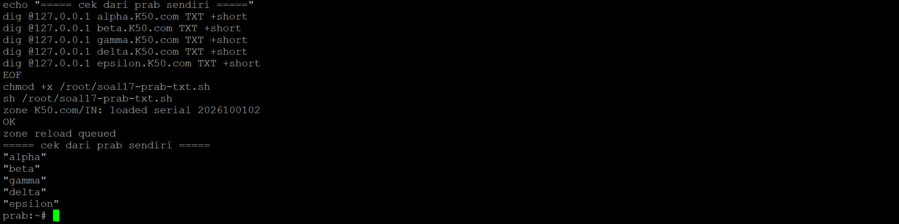

## Soal 17

> Tambahkan TXT record pada DNS untuk semua klien sayap kiri dan sayap kanan (Alpha, Beta, Gamma, Delta, Epsilon). Jika DNS di-query TXT terhadap nama domain mereka (contoh: alpha.\<xxxx\>.com), sistem harus mengembalikan teks berupa nama hostname mereka masing-masing (contoh: "alpha").

### Penjelasan

Lima record tipe TXT ditambahkan ke zone file `K50.com` di prab (master), masing-masing berisi nama hostname client itu sendiri. Serial SOA dinaikkan dari 2026100101 ke 2026100102 supaya tedd (slave) tahu ada perubahan zone dan langsung menarik data terbaru lewat zone transfer, tidak perlu menunggu refresh interval 3600 detik.

### Konfigurasi Prab (master)

```bash
cat > /root/soal17-prab-txt.sh << 'EOF'
#!/bin/sh
set -e

cp /var/bind/pri/K50.com.zone /var/bind/pri/K50.com.zone.bak

cat > /var/bind/pri/K50.com.zone << 'ZONE'
$TTL 3600
@       IN      SOA     prab.K50.com. root.K50.com. (
                        2026100102      ; Serial
                        3600
                        900
                        1209600
                        300 )

@       IN      NS      prab.K50.com.
@       IN      NS      tedd.K50.com.
@       IN      A       192.236.0.38

prab    IN      A       192.236.0.18
tedd    IN      A       192.236.0.19
rootkit IN      A       192.236.0.1

alpha   IN      A       192.236.0.2
beta    IN      A       192.236.0.3
gamma   IN      A       192.236.0.4
delta   IN      A       192.236.0.10
epsilon IN      A       192.236.0.11

alpha   IN      TXT     "alpha"
beta    IN      TXT     "beta"
gamma   IN      TXT     "gamma"
delta   IN      TXT     "delta"
epsilon IN      TXT     "epsilon"

abbey   IN      A       192.236.0.34
penny   IN      A       192.236.0.38

obladi  IN      A       192.236.0.26
desmond IN      A       192.236.0.27
oblada  IN      A       192.236.0.28
molly   IN      A       192.236.0.29

vault   IN      A       192.236.0.26
vault   IN      A       192.236.0.27
core    IN      A       192.236.0.28
core    IN      A       192.236.0.29

www     IN      CNAME   penny.K50.com.
static  IN      CNAME   abbey.K50.com.
ZONE

named-checkzone K50.com /var/bind/pri/K50.com.zone

rndc reload K50.com || { pkill named; sleep 1; named -u named; }

sleep 1
echo "===== cek dari prab sendiri ====="
dig @127.0.0.1 alpha.K50.com TXT +short
dig @127.0.0.1 beta.K50.com TXT +short
dig @127.0.0.1 gamma.K50.com TXT +short
dig @127.0.0.1 delta.K50.com TXT +short
dig @127.0.0.1 epsilon.K50.com TXT +short
EOF
chmod +x /root/soal17-prab-txt.sh
sh /root/soal17-prab-txt.sh
```

```
zone K50.com/IN: loaded serial 2026100102
OK
server reload successful
===== cek dari prab sendiri =====
"alpha"
"beta"
"gamma"
"delta"
"epsilon"
```

### Verifikasi

```bash
dig @127.0.0.1 K50.com SOA +short
dig @127.0.0.1 alpha.K50.com TXT +short
dig @127.0.0.1 epsilon.K50.com TXT +short
```

```
2026100102
"alpha"
"epsilon"
```



Hasil: di prab, seluruh lima TXT record (alpha, beta, gamma, delta, epsilon) mengembalikan nama hostname masing-masing. Di tedd, SOA serial terbaca 2026100102 (sesuai master) dan TXT record tersinkron identik, membuktikan zone transfer master-slave berjalan normal.